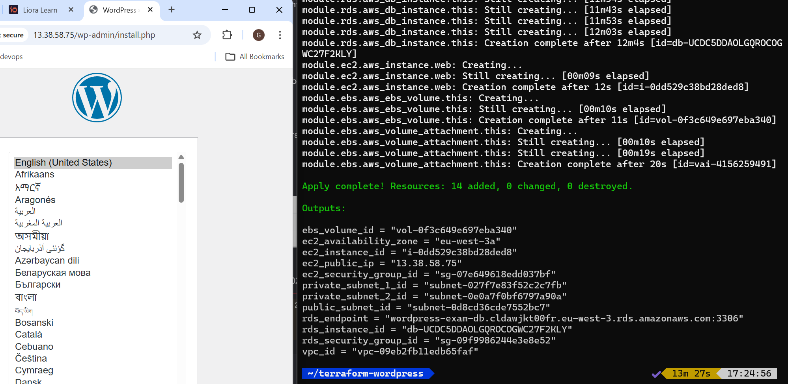

# Terraform WordPress Deployment

Infrastructure as Code project that deploys a complete WordPress environment on AWS with Terraform.

## Architecture

* VPC with one public subnet and two private subnets
* EC2 instance hosting WordPress
* RDS MySQL instance in Multi-AZ mode
* Additional EBS volume attached to the EC2 instance

## Technologies

* Terraform
* AWS EC2
* AWS RDS
* AWS VPC
* AWS EBS
* Bash

## Project structure

```bash
.
├── main.tf
├── variables.tf
├── outputs.tf
├── install_wordpress.sh
├── terraform.tfvars.example
└── modules/
    ├── networking/
    ├── ec2/
    ├── rds/
    └── ebs/
```

## How to use

```bash
terraform init
terraform plan
terraform apply
```

## Cleanup

```bash
terraform destroy --auto-approve
```

## Notes

* No AWS credentials are stored in the repository
* Sensitive values are passed through Terraform variables
* This project was built as a hands-on Terraform/AWS deployment exercise

## Screenshots

WordPress running on EC2 instance:


